# Sistema de Reserva de Salas

## 📌 Sumário
- [🌐 Apresentação](#-apresentação)
- [📋 Requisitos](#-requisitos)
- [💻 Telas do Sistema](#-telas-do-sistema)

## 🌐 Apresentação
O sistema trabalhado denomina-se Sistema de Reserva de Salas (SRS), é um sistema web desenvolvido na linguagem _Java_ com propósito de simplificar o processo de agendamento de salas. Com o SRS, os servidores da UFERSA têm capacidade de efetuar reservas de salas de aulas, laboratórios e auditórios de forma simples e eficiente. Além disso, o sistema oferece a possibilidade de verificar a disponibilidade dos espaços sem necessariamente ter acesso cadastrado no sistema, facilitando o planejamento e organização das atividades acadêmicas e eventos no campus. 

O sistema em questão foi registrado sob o número de processo BR512023002702-2, com validade de 50 anos no Instituto Nacional de Propriedade Industrial, em 19 de setembro de 2023, com a versão datada de 19 de agosto de 2022.

⚠️ No entanto, os testes foram conduzidos em uma versão adaptada do sistema, devido às melhorias e adaptações implementadas pelo desenvolvedor até a data do trabalho.

Para acessar o sistema, clique aqui: [SRS](https://srs.ufersa.edu.br/Sistema_Reserva_de_Salas/)

## 📋 Requisitos
### Requisitos Funcionais (RF)

| ID     | Descrição                                     |
|--------|-----------------------------------------------|
| RF001  | O sistema deve disponibilizar uma área (página) na qual os usuários possam se cadastrar. |
| RF002  | O sistema deve permitir o cadastro de usuários, em que devem informar o nome, e-mail, matrícula, login e senha. |
| RF003  | O sistema deve permitir que os usuários efetuem login, para terem acesso às operações disponibilizadas. |
| RF004  | O sistema deve permitir que os usuários efetuem a recuperação da senha, inserindo o e-mail associado no cadastro do sistema. |
| RF005  | O sistema deve permitir que os usuários cadastrados alterem seus dados. |
| RF006  | O sistema deve permitir que um usuário logado consiga cadastrar uma reserva, informando horário de início e fim, data, finalidade e espaço (sala). |
| RF007  | O sistema deve permitir que um usuário logado exclua sua própria reserva, desde que não esteja efetivada ou em curso. |
| RF008  | O sistema deve permitir que um usuário visualize os detalhes da reserva feita por ele. |
| RF009  | O sistema deve informar via e-mail a confirmação da reserva para o usuário. |
| RF010  | O sistema deve permitir que um usuário visualize todas as suas reservas. |
| RF011  | O sistema deve permitir que usuários visualizem as reservas feitas em uma data específica. |
| RF012  | O sistema deve permitir que usuários visualizem as reservas de uma sala específica por meio de um calendário. |
| RF013  | O sistema deve permitir que um usuário administrador gerencie usuários cadastrados (listar, editar e excluir). |
| RF014  | O sistema deve permitir que um usuário administrador gerencie salas e blocos (cadastrar, listar, editar e excluir). |
| RF015  | O sistema deve permitir que um usuário administrador realize reservas em lote, informando data de início e fim. |
| RF016  | O sistema deve permitir que um usuário administrador exclua reservas em lote. |
| RF017  | O sistema deve permitir que um usuário administrador liste todas as reservas cadastradas. |
| RF018  | O sistema deve permitir que um usuário administrador liste todas as reservas em lotes cadastradas por ele. |

### Requisitos Não-Funcionais (RNF)

| ID     | Descrição                                     |
|--------|-----------------------------------------------|
| RNF001 | O sistema deve funcionar interna e externamente à rede da UFERSA. |
| RNF002 | O sistema deve ser desenvolvido em sistema web. |
| RNF003 | O sistema deve apresentar uma interface simples e intuitiva para o usuário. |
| RNF004 | Para realizar o cadastro no sistema, é necessário que o usuário seja classificado como técnico-administrativo ou docente. |
| RNF005 | O sistema deve criptografar a senha dos usuários para armazená-la em seu banco de dados. |
| RNF006 | O sistema deve retornar um alerta/mensagem afirmando sucesso ou fracasso ao finalizar as operações. |

## 💻 Telas do Sistema
**⚠️ Observações** 
- Tamanho Desktop: 1920x1080 pixels
- Tamanho Tablet: 768x1280 pixels
- Tamanho Mobile: 375x780 pixels

Extensão utilizada para captura das imagens: [DevTools Chrome](https://developer.chrome.com/docs/devtools?hl=pt-br)

### Tela de Cadastro de Usuário
> A tela de cadastro de conta do usuário realiza o registro do usuário no sistema. Seu objetivo principal é que novos usuários se registrem no sistema, fornecendo as informações necessárias para criar uma conta e assim ter acesso às funcionalidades do sistema.

**Pré-Condições**
- O sistema está disponível e acessível. 

**Passos**
- O usuário acessa a tela de cadastro de conta, através do link vinculado na tela de login; 
- Na tela de cadastro, o usuário é solicitado a fornecer as seguinte informações:
	- Nome;
	- Email;
	- Matrícula;
	- Login;
	- Senha. 
- Após inserir as informações válidas, o usuário clica no botão "Cadastrar".

**Imagens**

Tela Desktop

Tela Tablet

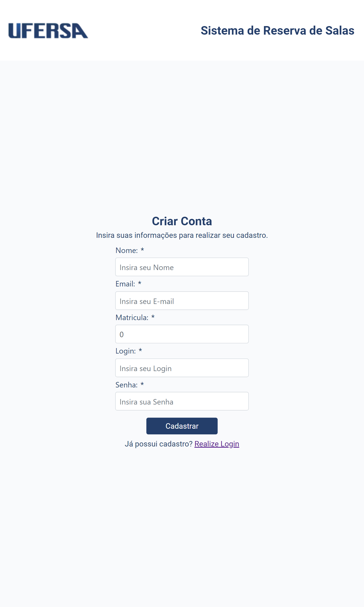

Tela Mobile

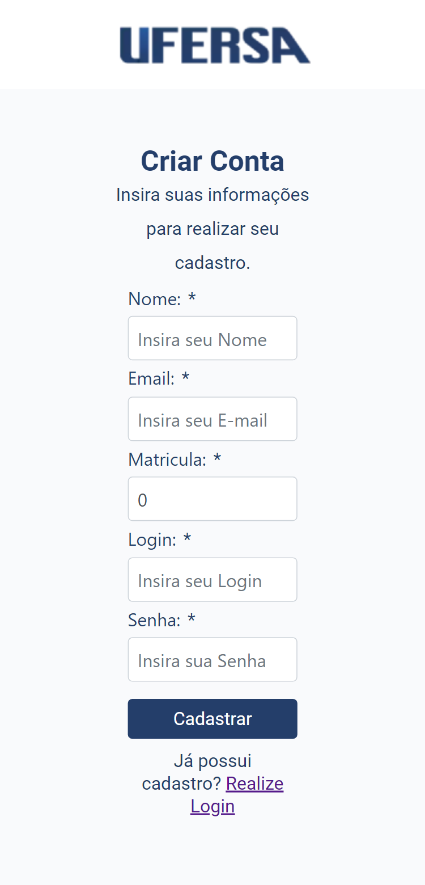

### Tela de Login
> A tela de login é a primeira interface onde os usuários interagem ao acessar o sistema. Seu objetivo principal é de autenticação, garantindo que apenas pessoas autorizadas tenham acesso às funcionalidades dentro do sistema.

**Pré-Condições**
- O sistema está disponível e acessível. 
- O usuário ter cadastro no sistema e suas credenciais estarem corretas.

**Passos**
- O usuário acessa a tela de login do sistema; 
- Insere o "Login" e "Senha" nos campos correspondentes; 
- Clica no botão "Entrar".

**Imagens**

Tela Desktop

Tela Tablet

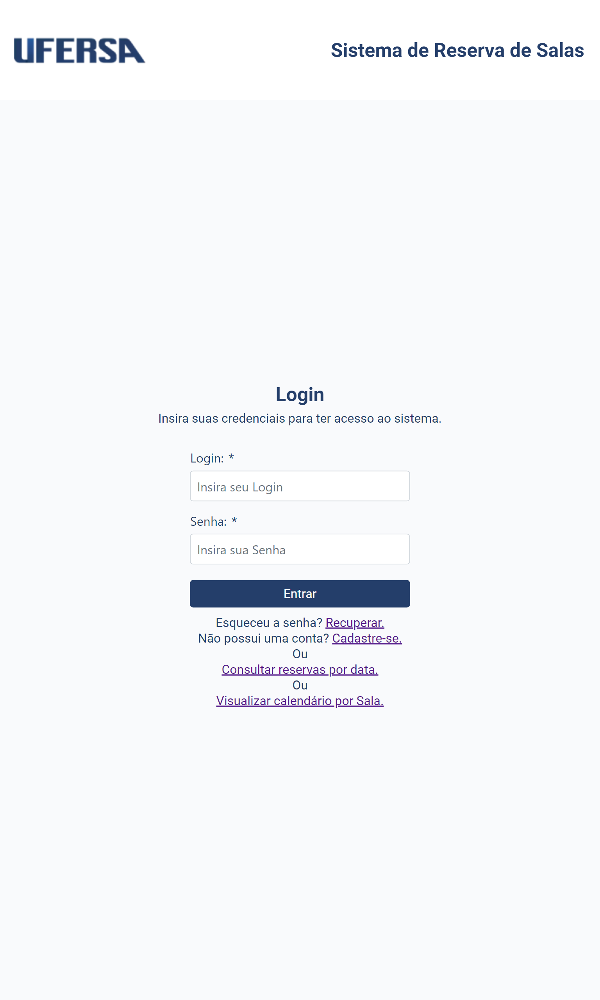

Tela Mobile

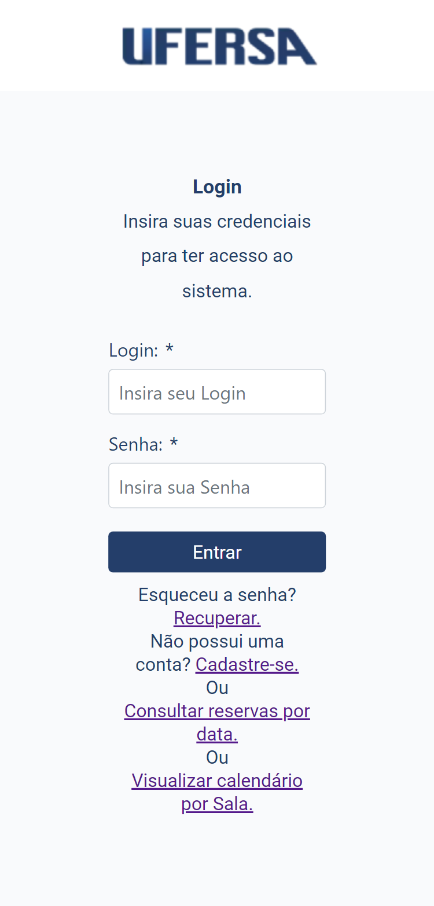

### Tela de Recuperar Senha
> A tela de recuperar senha realiza a recuperação de senha do usuário no sistema. Seu objetivo principal é de recuperação ao acesso no sistema, na qual permite que os usuários redefinam suas senhas caso as tenham esquecido, assim, é enviado ao seu e-mail de cadastro uma nova senha.

**Pré-Condições**
- O sistema está disponível e acessível. 
- O usuário ter registro no sistema.

**Passos**
- O usuário acessa a tela de recuperação de senha, através do link vinculado na tela de login; 
- Na tela de recuperação de senha, o usuário é solicitado a fornecer o endereço de e-mail associado à sua conta; 
- O usuário insere o "E-mail" no campo correspondente; 
- Clica no botão "Recuperar".

**Imagens**

Tela Desktop

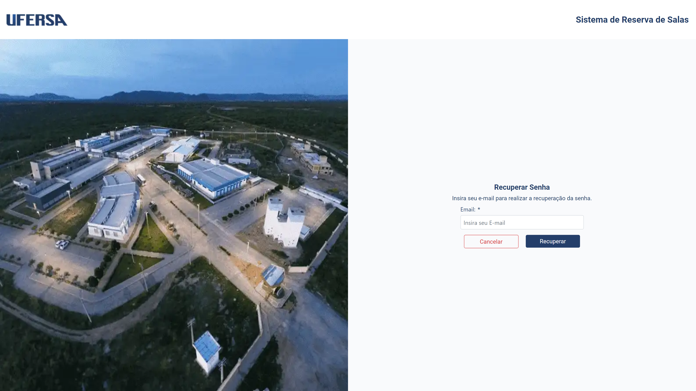

Tela Tablet

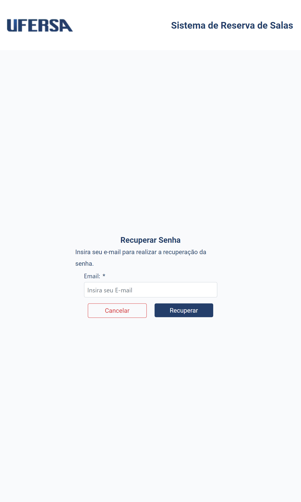

Tela Mobile

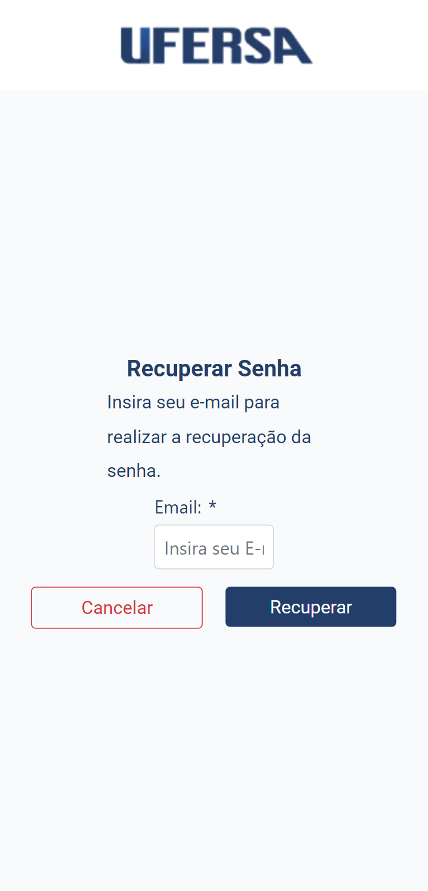

### Tela Ativação de Conta
> A tela de ativação de conta fica disponível após inserir as credenciais de login pela primeira vez para fazer acesso ao sistema, nela é necessário fornecer o código de ativação de conta. Seu objetivo principal é de autenticação e confirmação de cadastro garantindo a ativação da conta registrada no sistema.

**Pré-Condições**
- O sistema está disponível e acessível. 
- O usuário ter registro no sistema e suas credenciais estarem corretas.
- Ser o seu primeiro acesso.

**Passos**
- O usuário acessa a tela de login do sistema; 
- Insere o "Login" e "Senha" nos campos correspondentes pela primeira vez após o cadastro; 
- Clica no botão "Entrar";
- Insere o código de ativação enviado pelo e-mail.

Tela Desktop

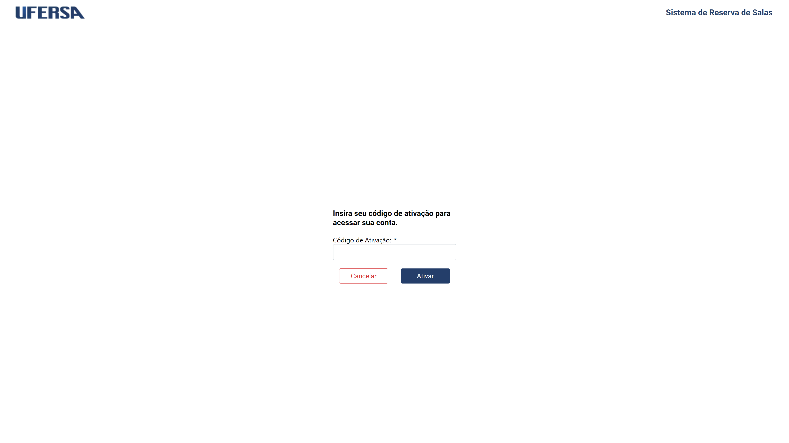

Tela Tablet

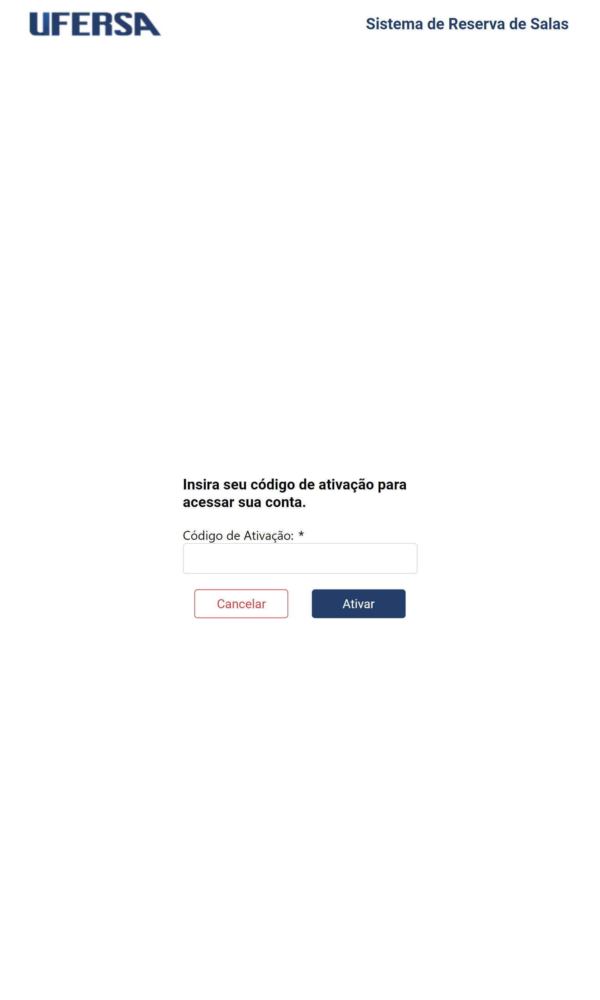

Tela Mobile

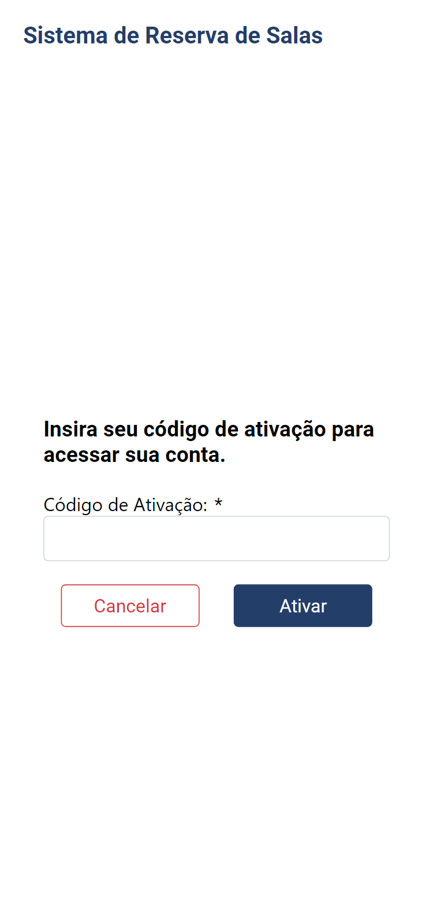

### Tela de Consultar Reserva por Data
> A tela de consulta de reserva por data realiza a listagem das reservas por data no sistema. Seu objetivo principal é de visualização das reservas filtrada pela data informada.

**Pré-Condições**
- O sistema está disponível e acessível. 

**Passos**
- O usuário acessa a consultar reserva por data, através do link vinculado na tela de login; 
- O usuário seleciona a data específica para a qual deseja consultar as reservas;
- O sistema realiza a listagem das reservas da data informada.

**Imagens**

Tela Desktop

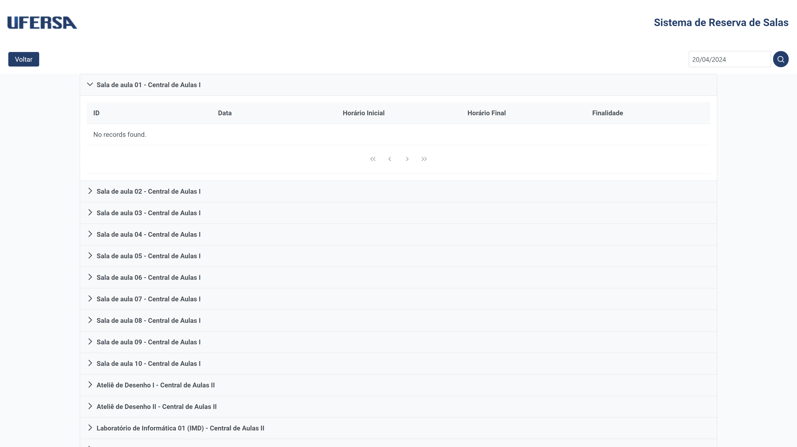

Tela Tablet

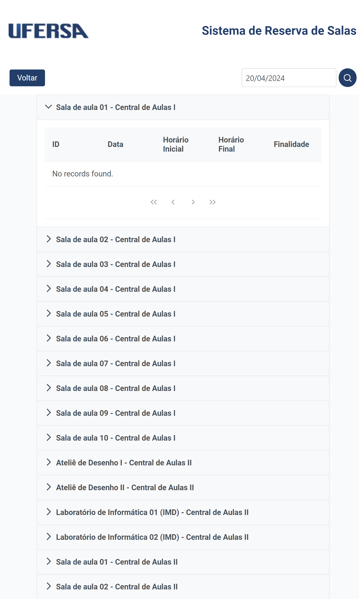

Tela Mobile

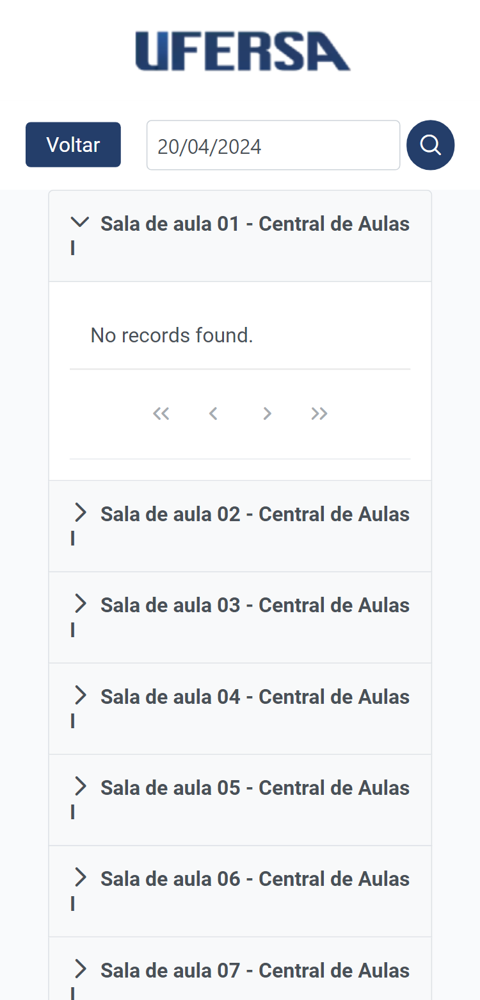

### Tela de Visualizar Calendário por Sala
> A tela de visualizar calendário realiza a listagem das reservas por sala diante de um calendário no sistema. Seu objetivo principal é de visualização dessas reservas em uma interface de calendário.

**Pré-Condições**
- O sistema está disponível e acessível. 

**Passos**
- O usuário acessa a visualização de calendário por sala, através do link vinculado na tela de login; 
- O usuário seleciona a sala específica para a qual deseja visualizar as reservas;
- O sistema exibe um calendário com as datas e as reservas agendadas para a sala selecionada.

**Imagens**

Tela Desktop

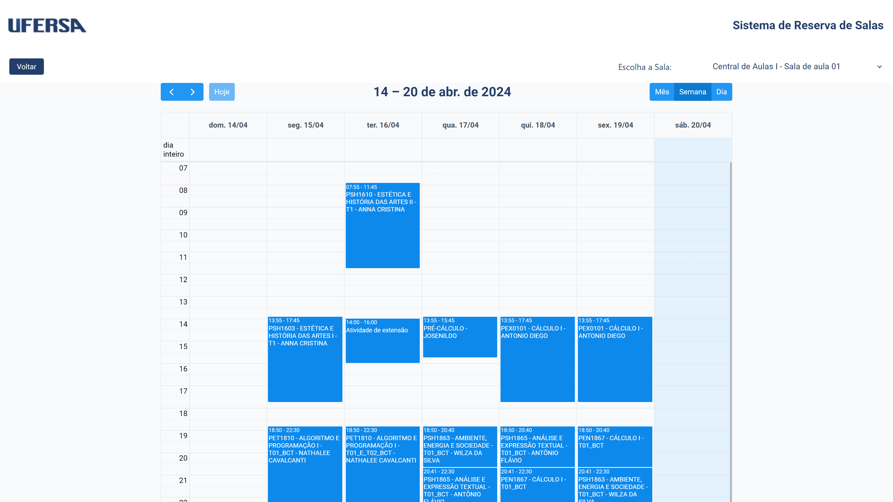

Tela Tablet

Tela Mobile

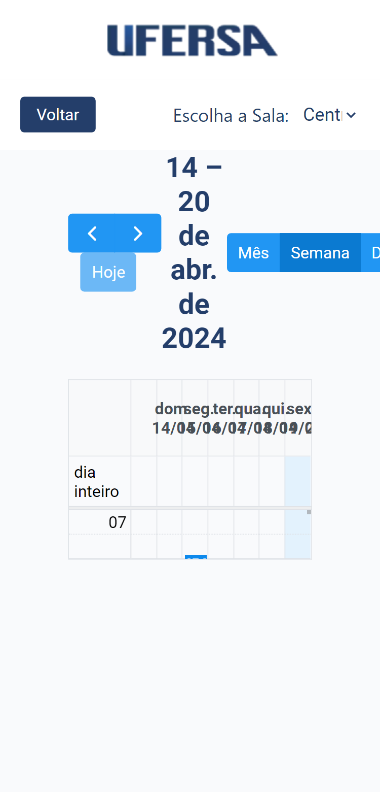

### Tela Home
> A tela home é a primeira página que o usuário visualiza após o acesso ao sistema. Seu objetivo principal é fornecer uma visão geral das funcionalidades do sistema, bem como os recursos disponíveis.

**Pré-Condições**
- O sistema está disponível e acessível. 
- O usuário está autenticado no sistema.

**Elementos da tela (Usuário Padrão)**
- Menu de navegação a esquerda fixo, com as opções:
- Home
- Reservas
	- Nova Reserva
	- Minhas Reservas
	- Consultas
- Meu Perfil
- Sair

**Elementos da tela (Usuário Administrador)**
- Menu de navegação a esquerda fixo, com as opções:
- Home
- Reservas
  - Nova Reserva
  - Reserva em Lote
  - Minhas Reservas
  - Consultas
  - Todas as Reservas
  - Listar Lotes
- Salas
  - Nova Sala
  - Listar Salas
- Usuários
- Meu Perfil
- Sair

**Imagens** 
:warning: A disponibilidade dessas imagens será restrita ao usuário administrador, uma vez que o usuário padrão possui especificações similares, mas com algumas funções ausentes.

Tela Desktop

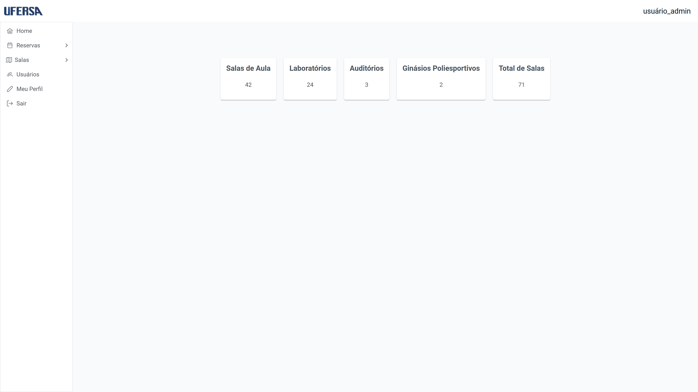

Tela Tablet

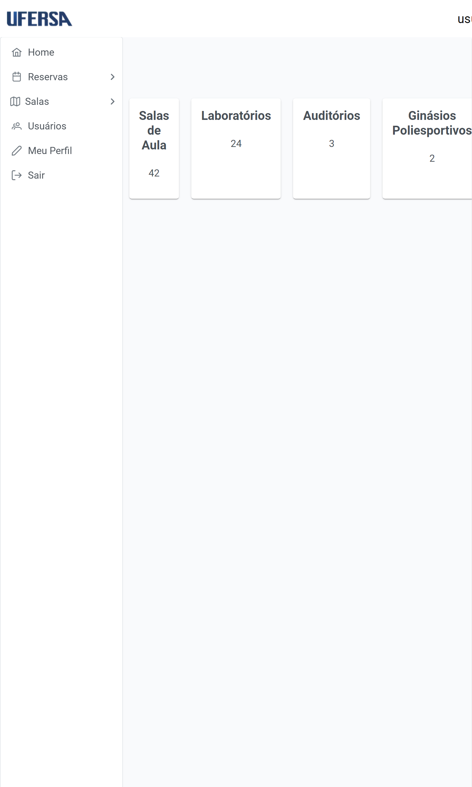

Tela Mobile

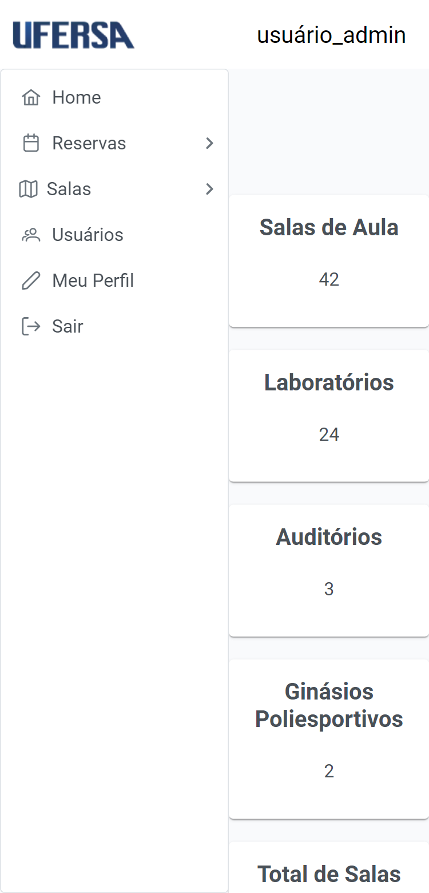

### Tela de Meu Perfil 
> A tela de alteração de dados realiza a mudança de informações (nome e/ou senha) no sistema. Seu objetivo principal é que os usuários possam realizar mudanças, caso haja necessidade, das informações que desejam.

**Pré-Condições**
- O sistema está disponível e acessível. 
- O usuário ter registro no sistema.

**Passos**
- O usuário acessa a opção de "Meu Perfil", através do menu lateral na tela home; 
- Na tela de edição, o sistema mostra as informações já registradas com possibilidade de mudanças nas seguinte informações:
	- Nome;
	- Senha. 
- Após inserir as informações válidas, o usuário clica no botão "Atualizar".

**Imagens**

Tela Desktop

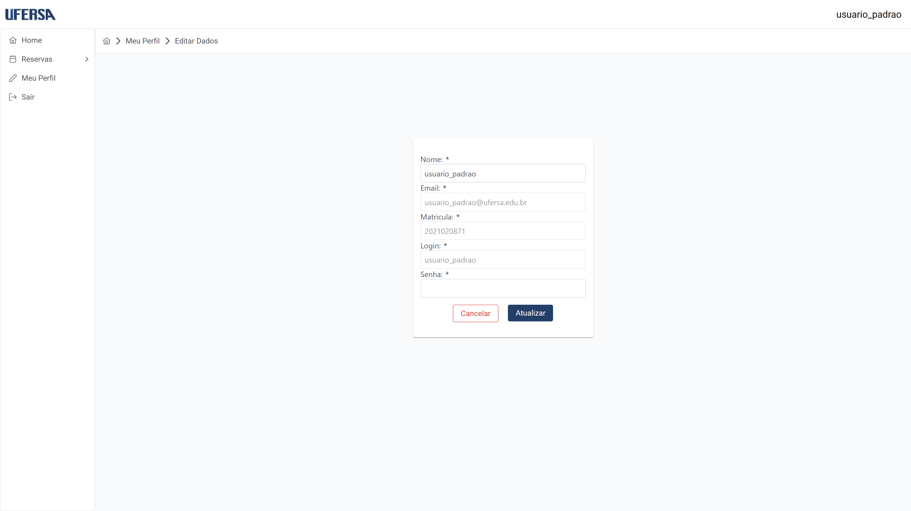

Tela Tablet

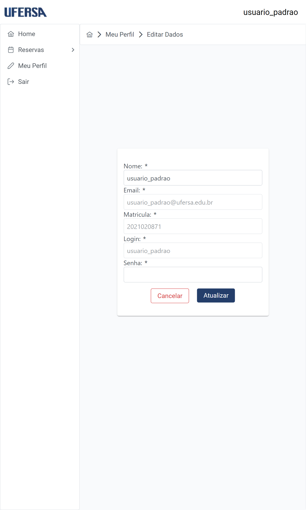

Tela Mobile

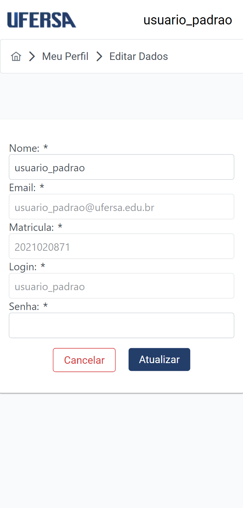

### Tela de Nova Reserva
> A tela de nova reserva realiza o registro da reserva da sala no sistema. Seu objetivo principal é que os usuários consigam registrar no sistema uma reserva de ambiente para usufruir dos recursos liberados pela universidade.

**Pré-Condições**
- O sistema está disponível e acessível. 
- O usuário está autenticado no sistema.

**Passos**
- O usuário acessa a opção de nova reserva, através do menu lateral na tela home; 
- Na tela de cadastro da reserva, o usuário é solicitado a fornecer as seguinte informações:
	- Data;
	- Horário Inicial;
	- Horário Final;
	- Finalidade. 
- Após inserir as informações válidas, o usuário clica no botão "Buscar";
- O sistema retorna as salas disponíveis para aquele dia e horário informado;
- O usuário clica no botão "Reservar".

**Imagens**

Tela Desktop

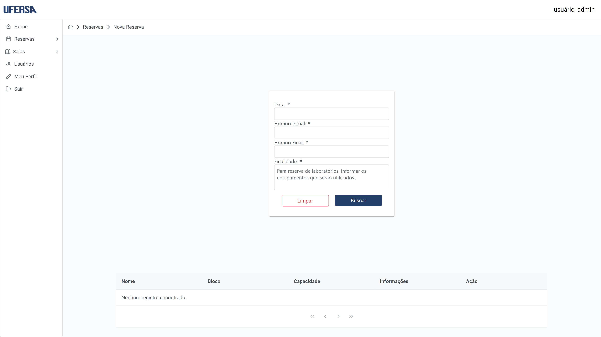

Tela Tablet

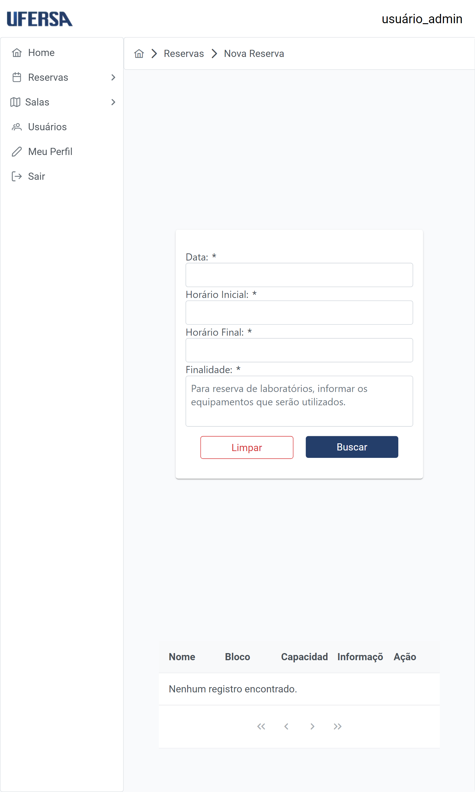

Tela Mobile

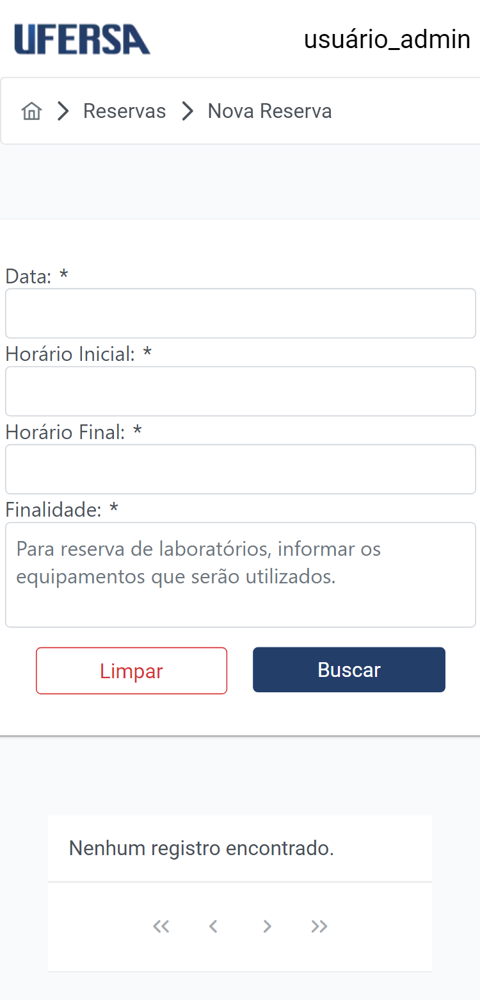

### Tela Minhas Reservas
> A tela de Minhas Reservas ou Listar Reservas irá mostrar as reservas realizadas pelo usuário logado. Seu objetivo principal é de listagem para a visualização das reservas cadastradas.

**Pré-Condições**
- O sistema está disponível e acessível. 
- O usuário ter registro no sistema e suas credenciais estarem corretas.

**Passos**
- O usuário acessa a opção de "Reserva", através do menu lateral na tela home. 
- O usuário acessa a opção "Minhas Reservas", após a abertura do menu expansivo.

Tela Desktop

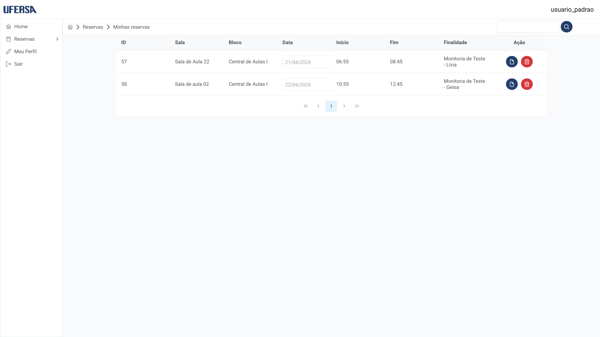

Tela Tablet

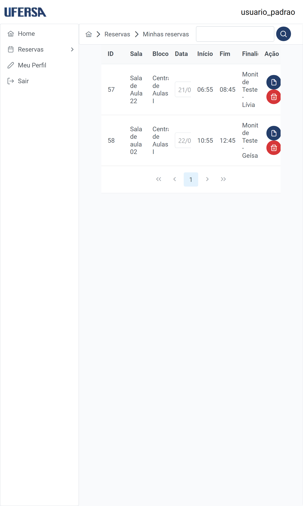

Tela Mobile

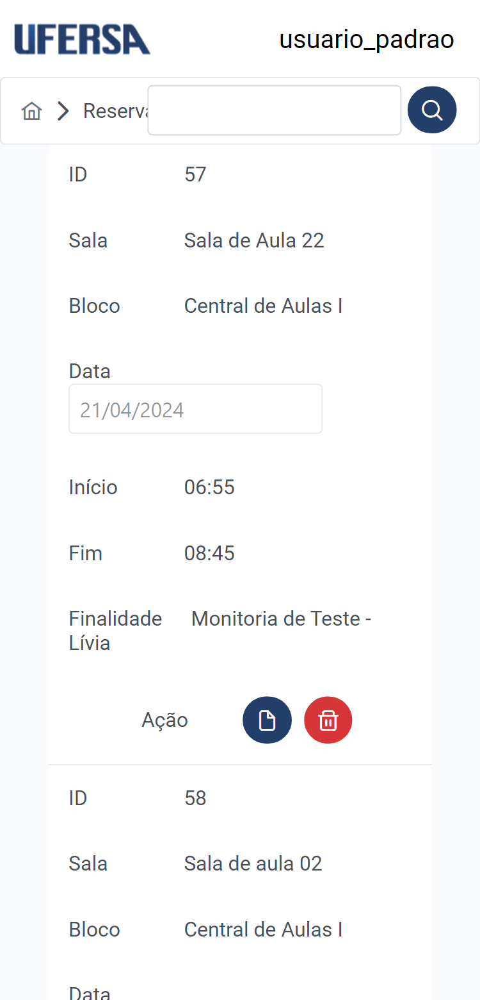

### Tela Reserva em Lote (Usuário Administrador)
> A tela de reserva em lote realiza o registro de várias reservas no sistema. Seu objetivo principal é que os usuários do tipo administrador consigam registrar no sistema um lote de reserva de uma única só vez.

**Pré-Condições**
- O sistema está disponível e acessível. 
- O usuário está autenticado no sistema e ser do tipo administrador.

**Passos**
- O usuário administrador acessa a opção de "Reserva", através do menu lateral na tela home. 
- O usuário administrador acessa a opção "Reserva em Lote", após a abertura do menu expansivo.
- Na tela de cadastro da reserva em lote, o usuário administrador é solicitado a fornecer as seguinte informações:
	- Data Inicial;
	- Data Final;
	- Horário Inicial;
	- Horário Final;
	- Finalidade (Nome da Disciplina - Nome e Sobrenome do professor). 
- Após inserir as informações válidas, o usuário administrador clica no botão "Buscar".
- O sistema retorna as salas disponíveis para as informações especificadas;
- O usuário administrador clica no botão "Reservar".

**Imagens**  
:warning: A disponibilidade dessas imagens será restrita ao usuário administrador, uma vez que o usuário padrão possui especificações similares, mas com algumas funções ausentes.

Tela Desktop

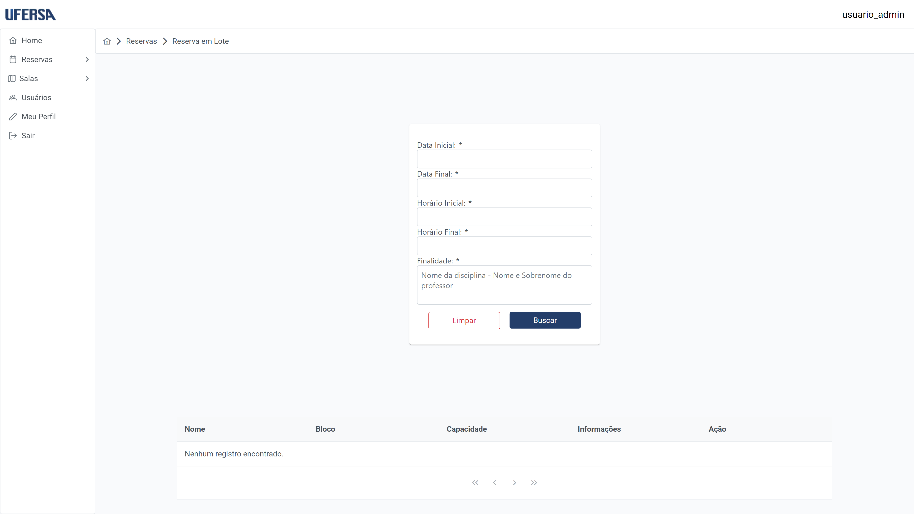

Tela Tablet

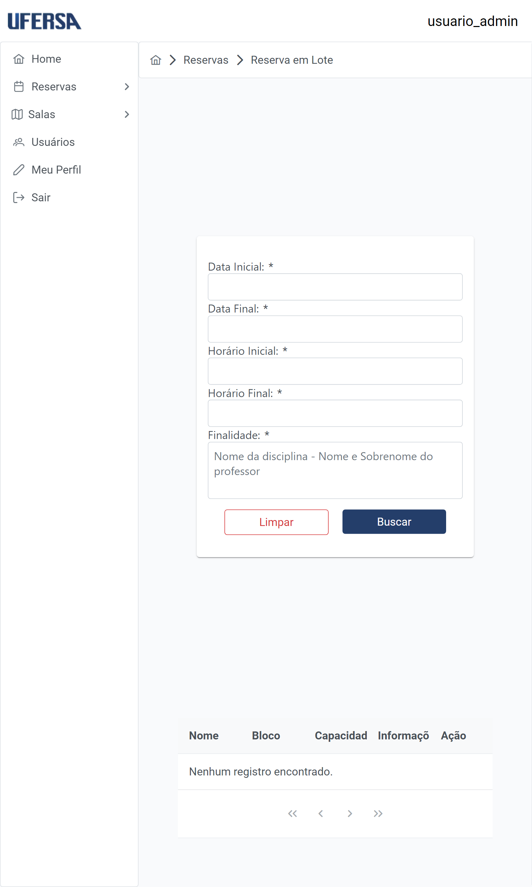

Tela Mobile

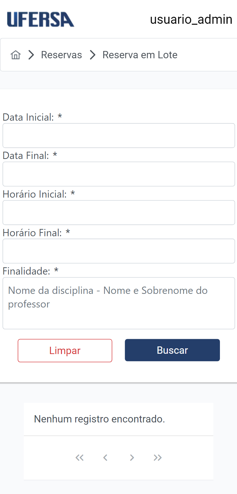

### Tela Todas as Reservas (Usuário Administrador)
> A tela de Todas as Reservas é disponível apenas para os usuários administradores e faz a listagem geral das reservas cadastradas no sistema (exceto as reservas em lote). Seu objetivo principal é de listagem das informações das reservas cadastradas.

**Pré-Condições**
- O sistema está disponível e acessível. 
- O usuário está autenticado no sistema e ser do tipo administrador.

**Passos**
- O usuário acessa a opção de "Reserva", através do menu lateral na tela home. 
- O usuário acessa a opção "Todas as Reservas", após a abertura do menu expansivo.

Tela Desktop

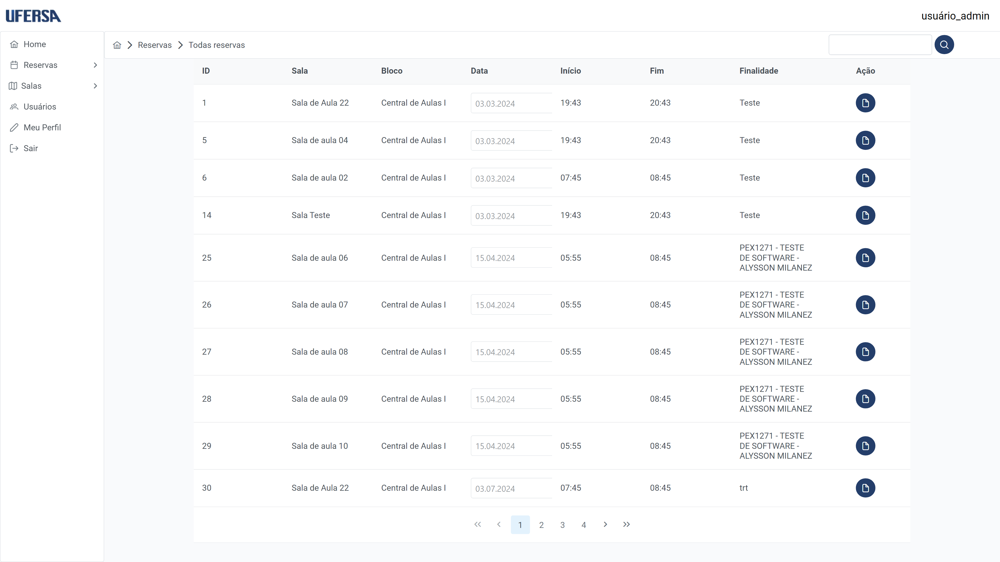

Tela Tablet

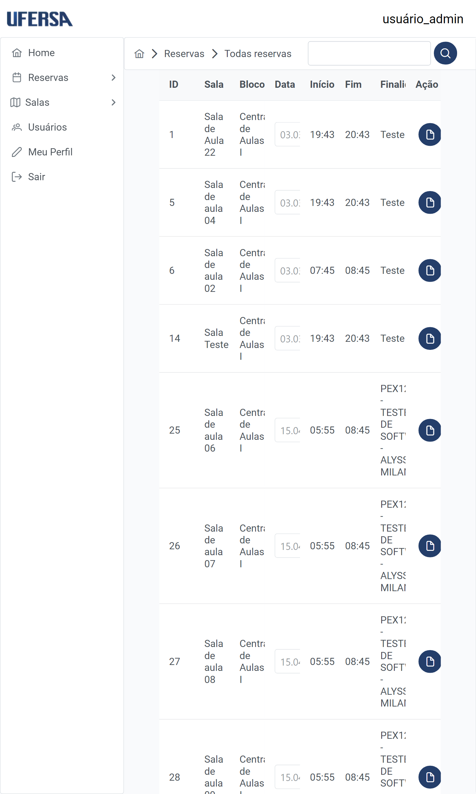

Tela Mobile

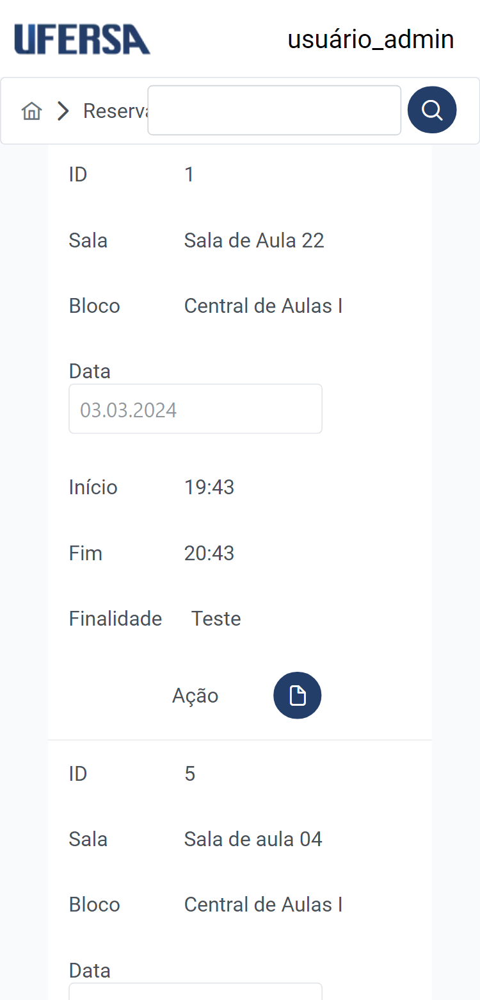

### Tela Listar Lotes (Usuário Administrador)
> A tela de Listar Lotes é disponível apenas para os usuários administradores e irá mostrar as reservas em lote realizadas cadastradas vinculada ao usuário logado. Seu objetivo principal é de listagem das informações das reservas em lote cadastradas. 

**Pré-Condições**
- O sistema está disponível e acessível. 
- O usuário está autenticado no sistema e ser do tipo administrador.

**Passos**
- O usuário acessa a opção de "Reserva", através do menu lateral na tela home. 
- O usuário acessa a opção "Listar Lotes", após a abertura do menu expansivo.

Tela Desktop

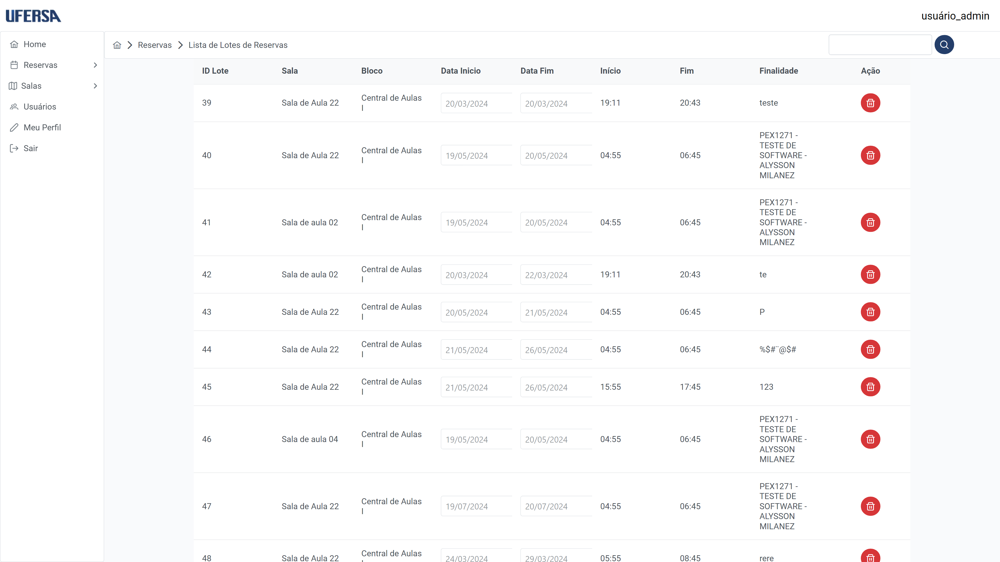

Tela Tablet

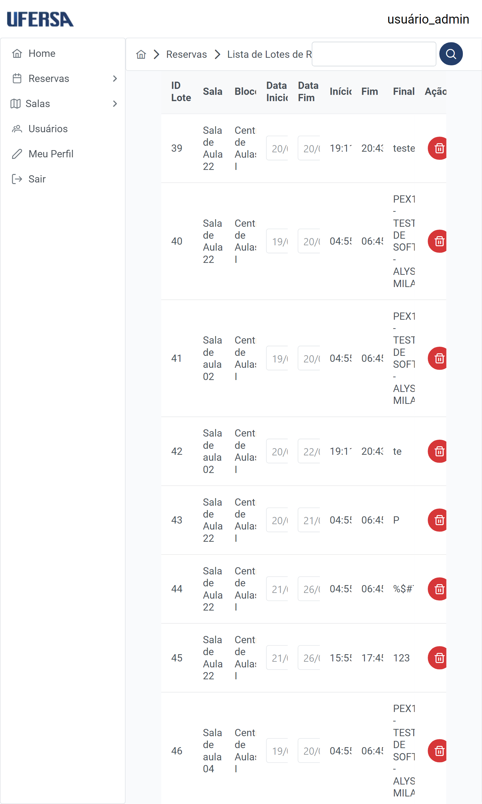

Tela Mobile

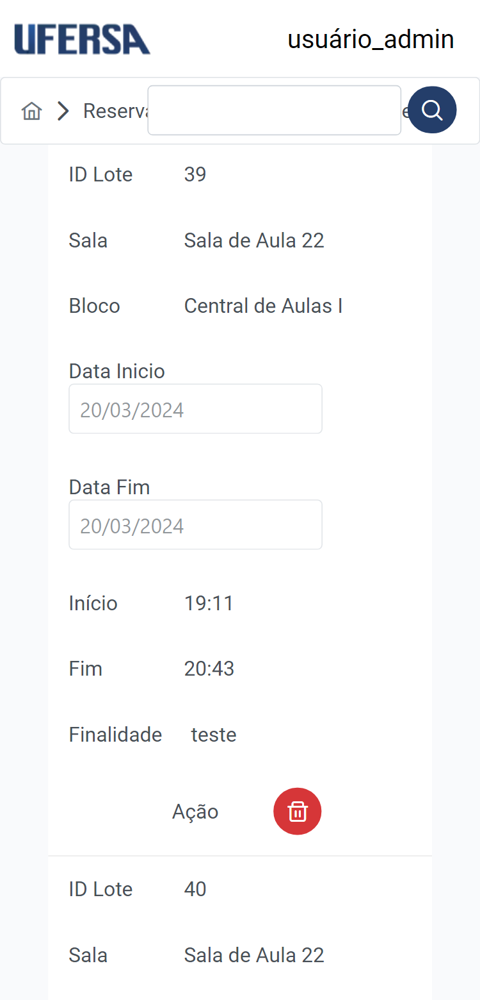

### Tela Listar Usuários (Usuário Administrador)
> A tela de Listar Usuários é disponível apenas para os usuários administradores e irá mostrar todos os usuários cadastrados no sistema. Seu objetivo principal é de listagem das informações dos usuários permitindo ao administrador fazer edições e/ou exclusão. 

**Pré-Condições**
- O sistema está disponível e acessível. 
- O usuário está autenticado no sistema e ser do tipo administrador.

**Passos**
- O usuário acessa a opção de "Usuários", através do menu lateral na tela home. 

Tela Desktop

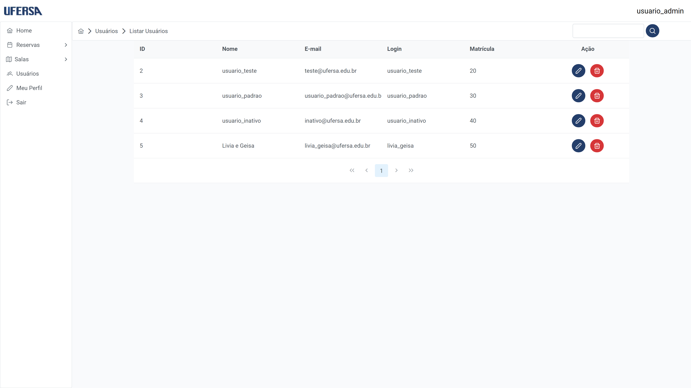

Tela Tablet

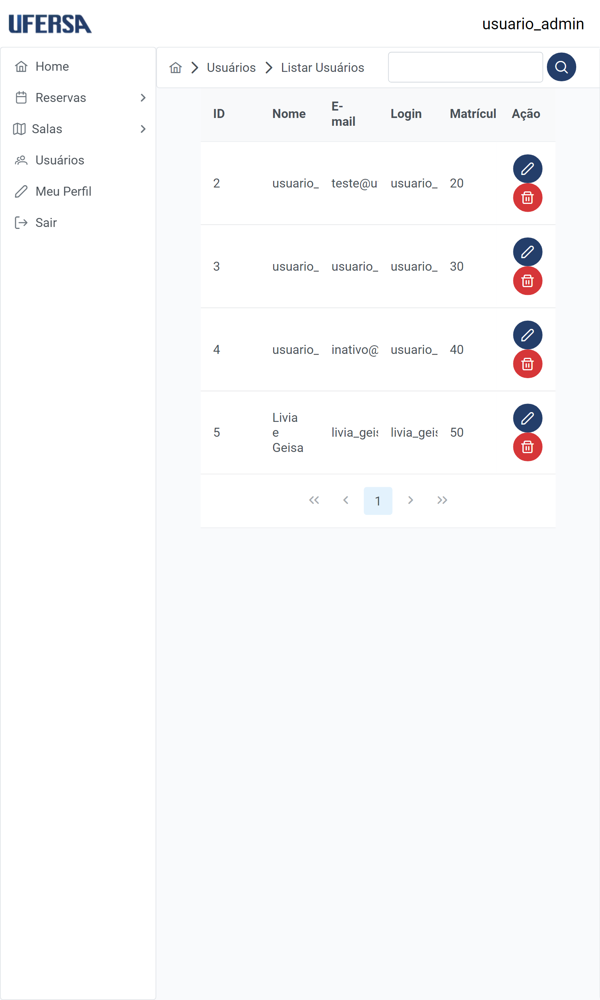

Tela Mobile

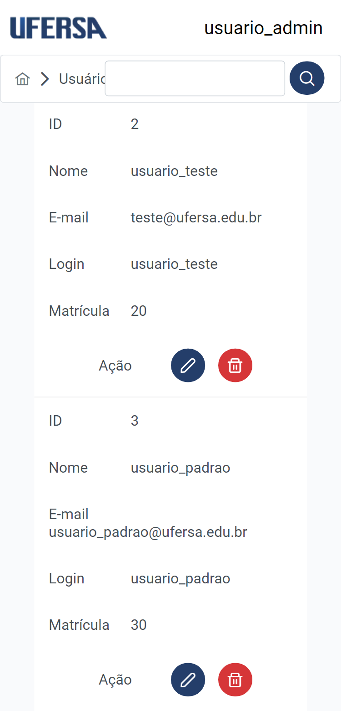

### Tela Nova Sala (Usuário Administrador)
> A tela de Nova Sala realiza o registro de um espaço físico no sistema. Seu objetivo principal é que os usuários administradores consigam registrar no sistema um ambiente para sincronizar com a realidade dos ambiente existentes da universidade.

**Pré-Condições**
- O sistema está disponível e acessível. 
- O usuário está autenticado no sistema e ser do tipo administrador.

**Passos**
- O usuário acessa a opção de "Sala", através do menu lateral na tela home.
- O usuário acessa a opção "Nova Sala", após a abertura do menu expansivo. 
- Na tela de cadastro de sala, o usuário administrador é solicitado a fornecer as seguinte informações:
	- Nome;
	- Capacidade;
	- Informações;
	- Bloco;
	- Status;
	- Tipo.
- Após inserir as informações válidas, o usuário administrador clica no botão "Cadastrar".

Tela Desktop

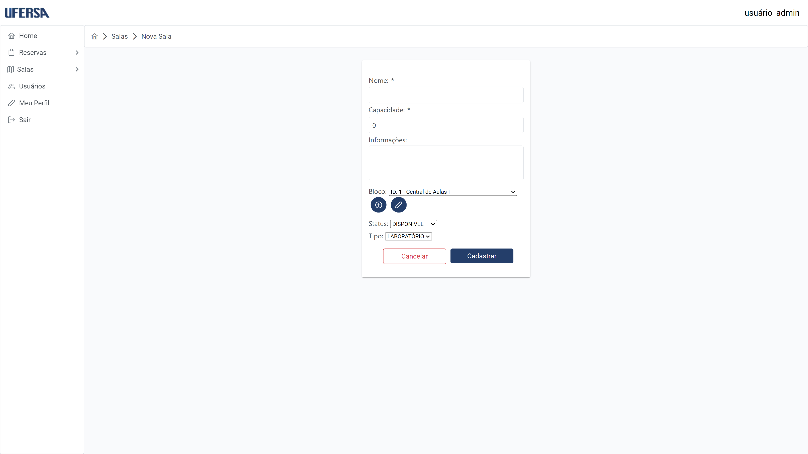

Tela Tablet

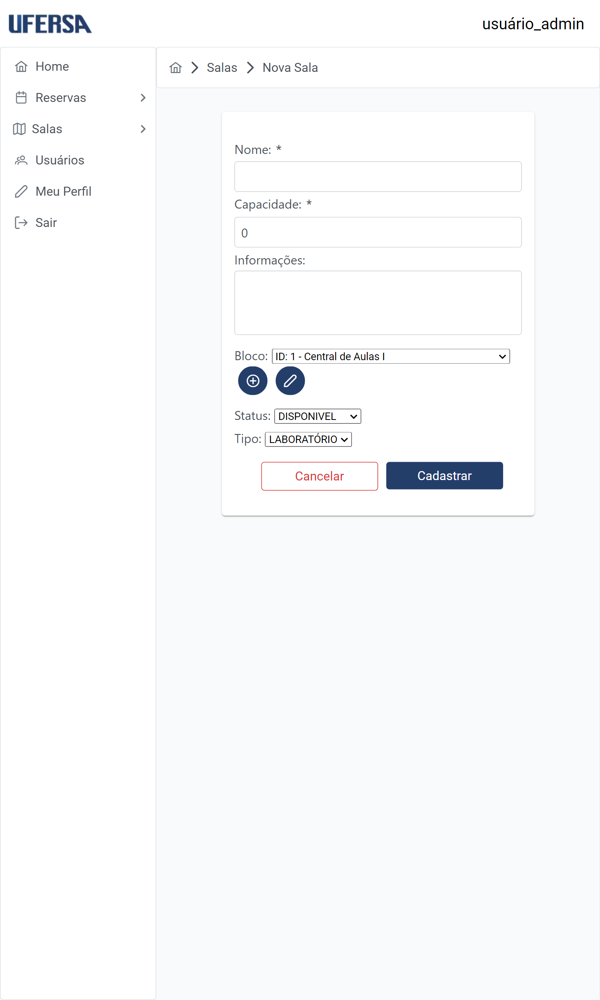

Tela Mobile

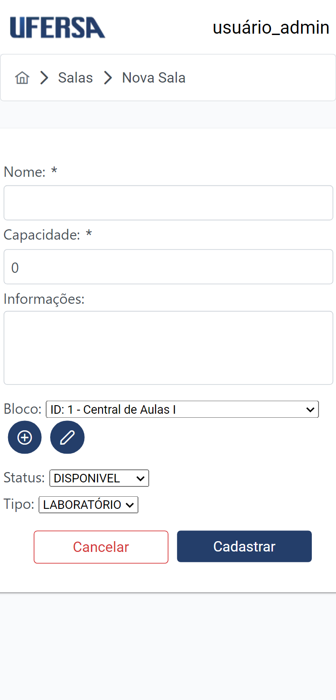

### Tela Editar Sala (Usuário Administrador)
> A tela de Edição de Sala é semelhante a tela de cadastro, porém com informações extras. Seu objetivo principal é que os usuários administradores consigam editar as informações inconsistentes dos ambientes registrados no sistema.

**Pré-Condições**
- O sistema está disponível e acessível. 
- O usuário está autenticado no sistema e ser do tipo administrador.

**Passos**
- O usuário acessa a opção de "Sala", através do menu lateral na tela home;
- O usuário acessa a opção "Listar Sala", após a abertura do menu expansivo;
- O usuário aperta no icone de lápis da sala que deseja editar;
- Na tela de edição de sala, o usuário administrador pode fornecer as seguinte informações:
	- Nome (obrigatório);
	- Capacidade (obrigatório);
	- Informações;
	- Status;
	- Bloco (obrigatório);
	- Tipo.
- Após inserir as informações válidas, o usuário administrador clica no botão "Atualizar".
- 

Tela Desktop

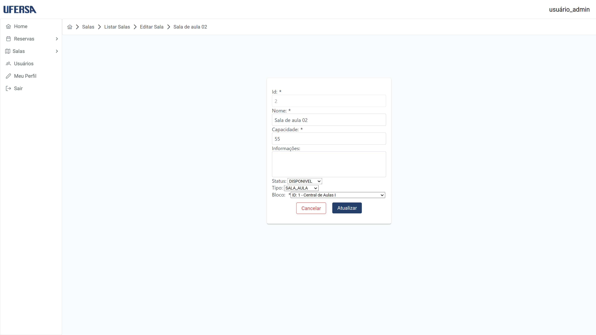

Tela Tablet

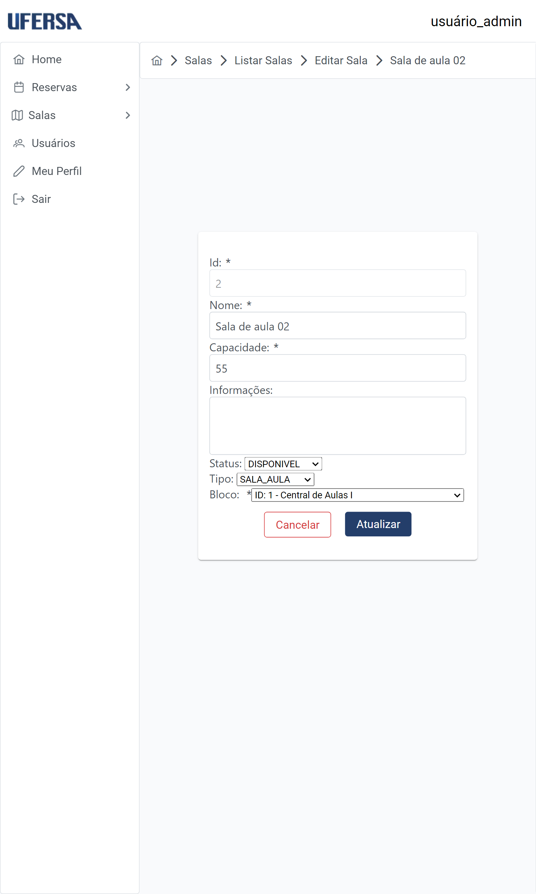

Tela Mobile

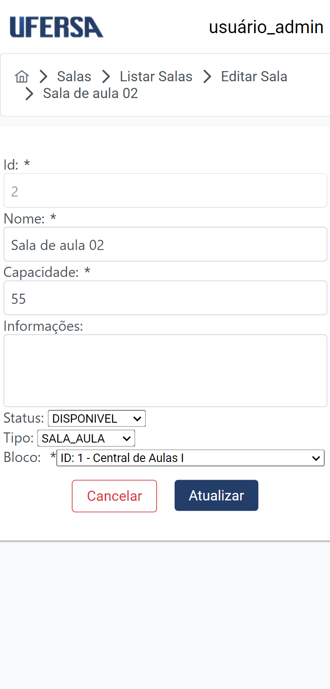

### Tela Listar Salas (Usuário Administrador)
> A tela de Listar Salas é disponível apenas para os usuários administradores e irá mostrar todos os espaços físicos cadastrados no sistema. Seu objetivo principal é de listagem das informações dos espaços permitindo ao administrador fazer edições e/ou exclusão. 

**Pré-Condições**
- O sistema está disponível e acessível. 
- O usuário está autenticado no sistema e ser do tipo administrador.

**Passos**
- O usuário acessa a opção de "Sala", através do menu lateral na tela home;
- O usuário acessa a opção "Listar Sala", após a abertura do menu expansivo.

Tela Desktop

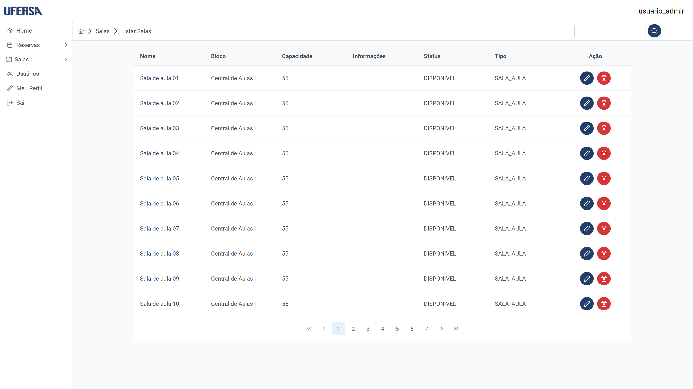

Tela Tablet

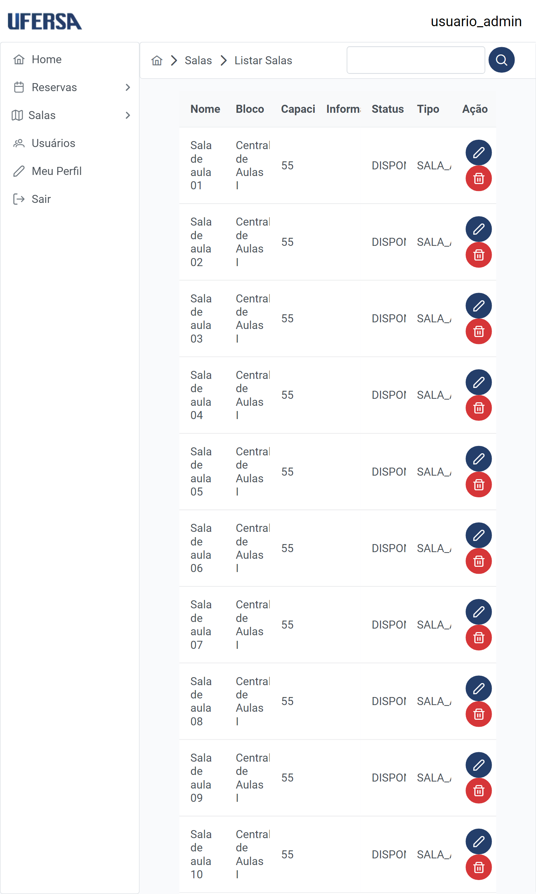

Tela Mobile

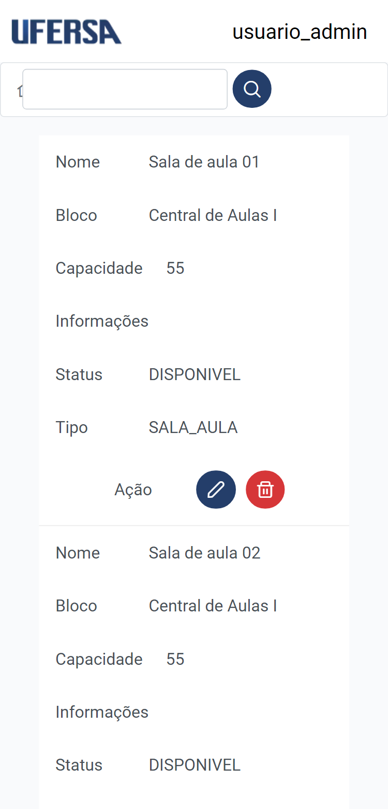

---
[🔙 Voltar](../)
