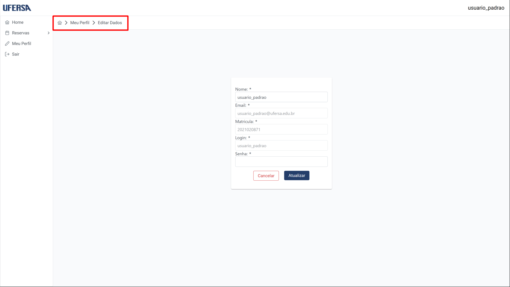
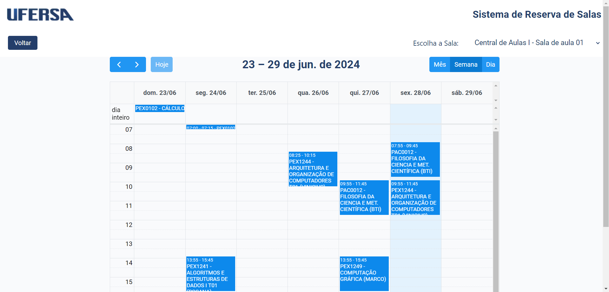
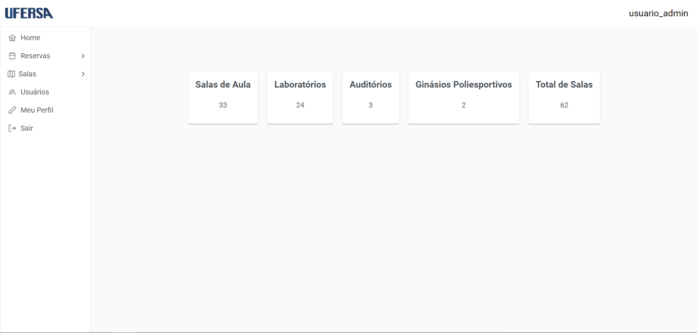
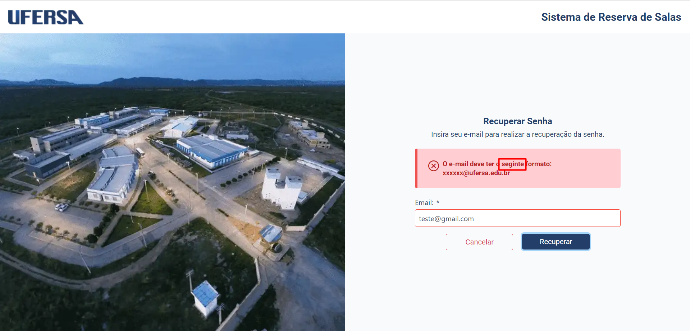
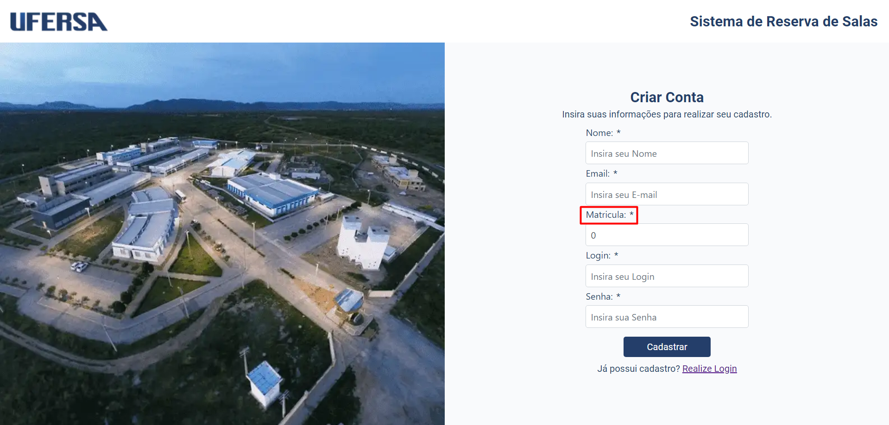
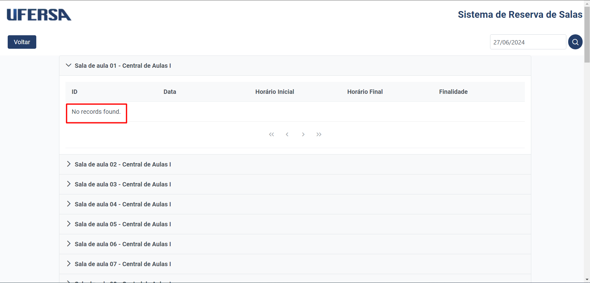
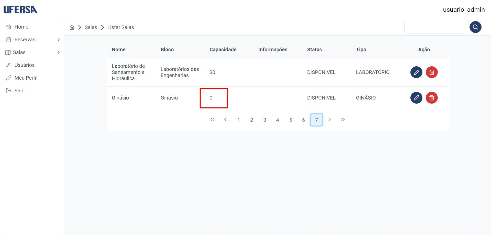
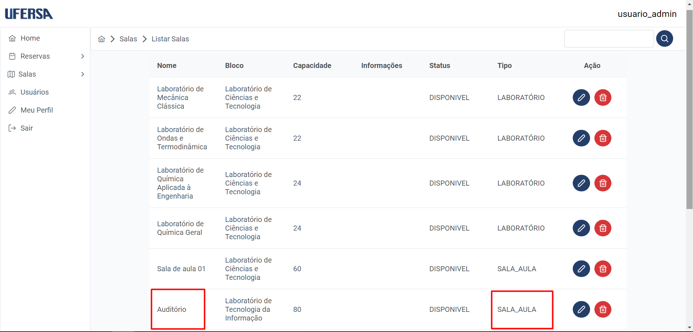

# Testes Exploratórios

## Introdução
Os testes de sistema, especialmente aqueles voltados para a interface gráfica (GUI), foram ampliados para incluir uma abordagem dinâmica conhecida como testes exploratórios. Diferente dos testes estruturados tradicionais, os testes exploratórios oferecem flexibilidade, permitindo um desenvolvimento mais livre das funcionalidades do sistema.

Nesta metodologia, os testadores têm a liberdade de navegar pelas diferentes partes da aplicação de forma não linear, identificando os demais erros que os testes estruturais não identificariam.

## 🧩 Estrutura dos Casos de Teste

Cada caso de teste é identificado pelo título na seguinte forma: "[CT001] - Barra de menu". CT indica Caso de Teste seguido por uma numeração sequencial e sua descrição. Posto isso, segue a descrição do teste, seguido é exibida uma imagem representativa do erro, após é declarado os demais tópicos como problema identificado, severidade do problema encontrado e observações adicionais para cada caso.

## 📊 Resultados dos Testes

### [CT001] - Barra de menu
- **Descrição do teste**: Teste de funcionalidade de navegação no menu de barra, seguindo o fluxo: Home > Meu Perfil > Editar Dados

- **Problema identificado**: Após clicar na opção "Editar Dados", não ocorre nenhuma mudança na interface do usuário.
- **Severidade do problema**: Alto - A funcionalidade de navegação não está funcionando conforme esperado.
- **Observações Adicionais**: Esse erro ocorre em todos os menus das ações do sistema, não sendo um problema isolado do menu "Editar Dados".

### [CT002] - Carregamento
- **Descrição do teste**: Teste de funcionalidade de busca, seguindo o fluxo: Reserva > Nova Reserva

- **Problema identificado**: A cada caractere inserido no campo de busca durante a criação de uma nova reserva, um ícone de andamento é visualizado no centro da tela.
- **Severidade do problema**: Média - Pode gerar confusão para os usuários.
- **Observações Adicionais**: A busca é sensível a maiúsculas e minúsculas.

### [CT003] - Alterações
- **Descrição do teste**: Teste de navegabilidade no layout da página “Visualizar Calendário por Sala”

- **Problema identificado**: É possível realizar alterações no layout das reservas ao visualizar o calendário.
- **Severidade do problema**: Baixa - Pode causar confusão, mas não afeta diretamente as reservas.
- **Observações Adicionais**: A alteração é visível apenas para o usuário que fez a modificação.

### [CT004] - Sessão Expirada
- **Descrição do teste**: Teste de disponibilidade, tempo excedido no sistema.

- **Problema identificado**: O sistema não mostra que a sessão expirou após um tempo excedido de inatividade.
- **Severidade do problema**: Alta - Pode gerar frustração e perda de trabalho para os usuários.
- **Observações Adicionais**: Não foi identificado o tempo excedido do sistema.

### [CT005] - Erros Ortográficos (Recuperação de Senha)
- **Descrição do teste**: Teste de funcionalidade na página de recuperação de senha com escrita incorreta.

- **Problema identificado**: Erro de ortografia na mensagem de validação do formato do e-mail inserido.
- **Severidade do problema**: Baixa - Não interfere no funcionamento do sistema.
- **Observações Adicionais**: O erro é exibido apenas ao tentar recuperar senha com um e-mail inválido.

### [CT006] - Erros Ortográficos (Cadastro de Conta)
- **Descrição do teste**: Teste de funcionalidade na página de cadastro de conta com escrita incorreta.

- **Problema identificado**: Erro de ortografia no campo de matrícula.
- **Severidade do problema**: Baixa - Não interfere no funcionamento do sistema.

### [CT007] - Sala inexistente
- **Descrição do teste**: Teste de visualização na página de calendário das salas disponíveis para reserva.

- **Problema identificado**: Exibição de uma sala no sistema que não existe mais fisicamente.
- **Severidade do problema**: Alta - Pode causar conflito de agendamento.
- **Observações Adicionais**: A sala está disponível no sistema para reservas, apesar de não existir fisicamente.

### [CT008] - Padronização de linguagem
- **Descrição do teste**: Teste na funcionalidade de consulta de reservas.

- **Problema identificado**: Uso de linguagem não padrão ("No records found.") em vez de português.
- **Severidade do problema**: Baixa - Quebra a padronização do sistema.

### [CT009] - Informação Incorreta atributo capacidade
- **Descrição do teste**: Teste na funcionalidade de listar salas (usuário administrador) no atributo capacidade.

- **Problema identificado**: Capacidade incorreta atribuída ao Ginásio Poliesportivo.
- **Severidade do problema**: Alto - Inconsistência e incoerência dos dados.

### [CT010] - Informação Incorreta atributo tipo
- **Descrição do teste**: Teste na funcionalidade de listar salas (usuário administrador) no atributo tipo.

- **Problema identificado**: Tipo incorreto atribuído à sala "Auditório".
- **Severidade do problema**: Alto - Inconsistência e incoerência dos dados.

### [CT011] - Sala com status INDISPONÍVEL
- **Descrição do teste**: Teste na funcionalidade de listar salas (usuário administrador) no atributo status.

- **Problema identificado**: Status "indisponível" atribuído à sala "Sala Indisponível" sem funcionalidade no sistema.
- **Severidade do problema**: Alto - Inconsistência e incoerência dos dados.

---
[🔙 Voltar para a página anterior](../tests/introducao.md)