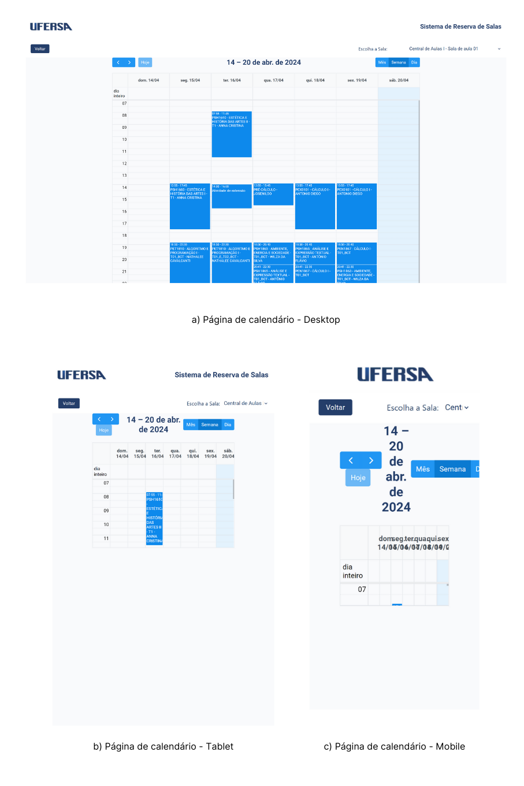
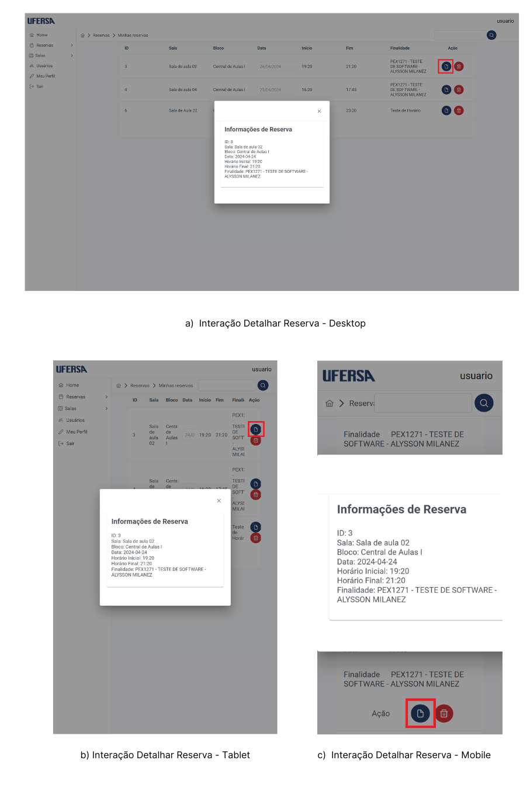
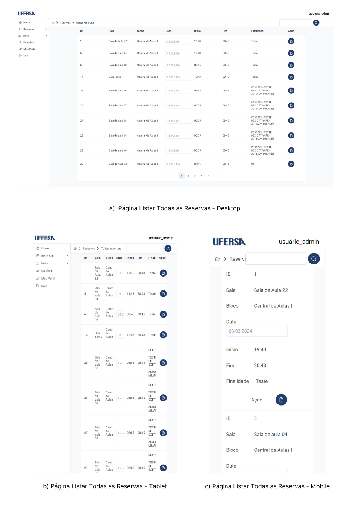
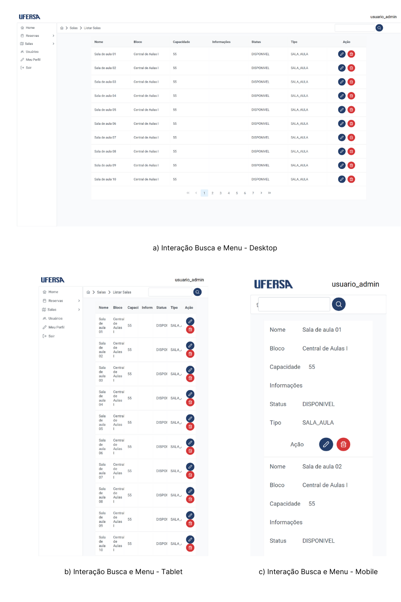

# Testes de Responsividade

## 💡 Introdução

Os testes de responsividade nas páginas web visam verificar a capacidade do sistema em se adaptar a diferentes tamanhos de tela. Os padrões de tamanho estabelecidos para este propósito são:

- **Desktop:** 1920x1080 pixels
- **Tablet:** 768x1280 pixels
- **Mobile:** 375x780 pixels

Os testes serão conduzidos em todas as páginas do sistema, incluindo as interações com o usuário. Esta documentação destaca os erros mais significativos encontrados durante os testes de responsividade.

## 🧩 Estrutura dos Casos de Teste

Cada caso de teste é identificado pelo título na seguinte forma: "[CT001] - Tela Calendário". CT indica Caso de Teste seguido por uma numeração sequencial e sua descrição. Após o título, são exibidas imagens representativas das três telas nos tamanhos Desktop, Tablet e Mobile, seguidas por uma descrição do erro encontrado.

## 📊 Resultados dos Testes

### [CT001] - Tela Calendário

**Descrição**:
Durante os testes de responsividade, foram observados problemas na adaptação da tela de calendário em dispositivos móveis. A interface apresenta sobreposição de elementos e dificuldades na interação com as datas.

### [CT002] - Interação Detalhar Reserva

**Descrição**:
Ao interagir com o pop-up de detalhes da reserva, identificou-se que a versão para dispositivos móveis não possui um botão adequado para fechar o pop-up, dificultando a navegação do usuário de volta à página anterior.

### [CT003] - Tela Todas Reservas

**Descrição**:
A tela de listar todas as reservas do usuário administrador apresenta problemas de layout no modo Tablet. As informações das reservas ficam truncadas e há dificuldade na visualização completa das datas.

### [CT004] - Tela Listar Usuários

**Descrição**:
Durante os testes de responsividade, foi identificado que a tela de listar usuários não se ajusta corretamente no formato Tablet. Os atributos como nome, e-mail, login e matrícula são cortados quando muito extensos.

### [CT005] - Interação Calendário na pesquisa

**Descrição**:
Na página de visualização do calendário, a interação não se adapta de forma adequada nos dispositivos móveis. Os usuários enfrentam dificuldades para selecionar dias específicos devido à interface do calendário que não é completamente visível.

### [CT006] - Interação Busca e Menu

**Descrição**:
Durante os testes de responsividade, a interação de busca na tela de listar salas do usuário administrador não se adapta corretamente nos dispositivos móveis. A barra de menu fica coberta pelo campo de inserção de informação, tornando difícil a navegação entre as páginas.

---
[🔙 Voltar](../tests/introducao.md/#️-roteiro-de-teste)